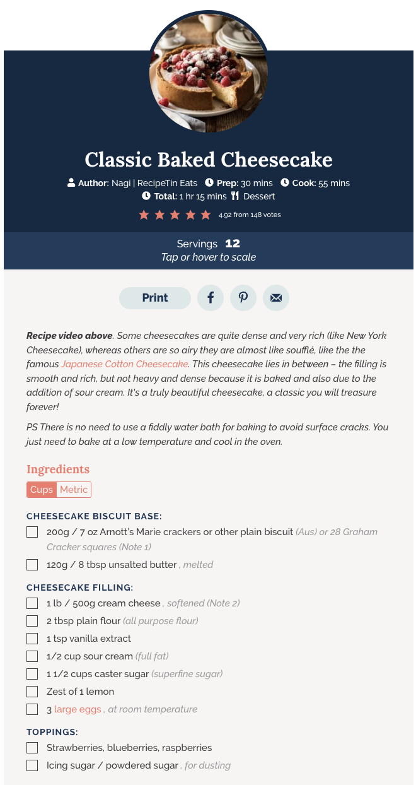

# Food Chart

Enter a recipe URL or raw ingredient text, and the app parses ingredients into a **pie chart by ingredient ratio**.  
For ingredients that are hard to convert with fixed rules (for example, `a pinch of salt`), it also predicts grams using a **lightweight ML model**.


<table>
  <tr>
    <td align="center"><b>Recipe Text Input</b></td>
    <td align="center"><b></b></td>
    <td align="center"><b>Chart Transformation</b></td>
  </tr>
  <tr>
    <td></td>
    <td align="center" style="font-size: 32px; vertical-align: middle;">➡️</td>
    <td></td>
  </tr>
</table>

---

## Key Features

- **Input mode switch**: `URL Mode` / `Text Mode`
- **Automatic parsing**: `Convert to Chart` splits into `chartData` and `exceptData`
- **Pie chart visualization**: Displays ingredient ratios and percentages
- **Quantity adjustment**: `Adjust Ingredient` recalculates other ingredient amounts based on a selected ingredient amount
- **Gram prediction for exception items**: `Predict Grams for Except Data`
- **Model switching**: `deberta`, `phi3`, `llama3:8b`

---

## Why This Project

Recipe units are highly inconsistent (`cup`, `tbsp`, `clove`, `pinch`, `package`, `whole`, etc.),  
so a fixed conversion table alone is not enough for reliable weight estimation.

This project focuses on:

- Immediate chart visualization for directly convertible ingredients
- ML-based correction for ambiguous units and expressions
- End-to-end workflow from input to result in one screen

---

## Quick Start

### 1) Clone

```bash
git clone https://github.com/kml-coder/food_chart_public.git
cd food_chart_public
```

### 2) Download local model (DeBERTa)

- DeBERTa model: [Google Drive](https://drive.google.com/file/d/1AfjS5NNvzprcqNseWBcMeUQbv3g_hxoM/view?usp=sharing)
- Set the model path with `DEBERTA_MODEL_PATH`
```bash
export DEBERTA_MODEL_PATH="$HOME/<paste-your-model-folder-path>"
```
### 3) Run with Docker

```bash
docker compose up --build
```

- Frontend: `http://localhost:8080`
- Backend: `http://localhost:5050`

### 4) Or deploy it

The web bundle and the API are served from one origin, on a free Hugging Face
ZeroGPU Space. See [`DEPLOY.md`](DEPLOY.md).

---

## Runtime Requirements

This project supports multiple gram-prediction backends in runtime.

- Default local path: DeBERTa regression model (`DEBERTA_MODEL_PATH`)
- Optional LLM backends via Ollama: `phi3`, `llama3:8b`

If you want Ollama backends, install and pull models:

```bash
ollama pull phi3
ollama pull llama3:8b
```

Optional environment variables:

```bash
DEBERTA_MODEL_PATH=/path/to/deberta_model
OLLAMA_URL=http://localhost:11434/api/chat
OLLAMA_MODEL=phi3
USE_OLLAMA_GRAMS=true
```

Backend selection in UI:
- `deberta`: local DeBERTa regression
- `phi3`, `llama3:8b`: Ollama chat API

Fallback behavior (high level):
- If a selected backend is unavailable, the server falls back to another available path and finally to heuristic estimation.

---

## Project Structure

```text
food_app/        # React Native / Expo UI
food_server/     # Flask API + inference routing
food_model/      # Data cleaning, training notebooks, experiments
```

---


## Model Strategy

Input is a fixed `{unit, size, name}` schema and the output is a single number, so I
treated it as a regression problem and trained an encoder model
(`microsoft/deberta-v3-base`, `num_labels=1`) rather than reaching for a large LLM.
The Ollama backends stay in the runtime so the two approaches can be compared from
the UI directly.

### Does the model actually beat a lookup table?

Since the input is just `{unit, size, name}`, a fair objection is that a per-unit
average might do the same job. Measured on the **same validation split**:

| Method | Learned | MAE (g) | MAPE (%) | Within 20% |
| --- | :--: | ---: | ---: | ---: |
| Per-unit median lookup | ✗ | 63.93 | 691.1 | 0.278 |
| Per-(unit × size) median lookup — best untrained | ✗ | 61.65 | 639.8 | 0.301 |
| **DeBERTa v3 (shipped)** | ✓ | **38.87** | **40.5** | **0.544** |

MAE −37 %, Within-20% **1.81×**.

The gap exists because the same unit means different weights for different
ingredients — `1 cup` is 16 g of cilantro but 248 g of milk, a **15× spread**. A
lookup keyed on `unit` never reads the ingredient name, so that variance is
structurally unreachable for it.

Reproduce: `python3 food_model/gptgram_model/eval_baselines.py` (numpy only, no torch).

> **On MAPE:** the headline MAPE looks alarming because the dataset is full of
> single-digit-gram ingredients, and MAPE divides by the true value (2 g predicted as
> 6 g is 200 % but only 4 g off). Since the product output is a **proportion pie
> chart**, sub-2 % slices land within **2.13 pp** of correct — invisible on screen —
> while the large ingredients that actually decide the chart sit at MAPE 30 %.
> Details and the slice-error measurement are in the model doc.

- Detailed document: [`readme_model_details.md`](docs/readme_model_details.md)
- Baseline reproduction: `food_model/gptgram_model/eval_baselines.py`

---


## Training Data Used


I trained the gram-prediction model using:

- `food_model/gptgram_model/final_unit_removed.json`

Example row format (simplified):

```json
{
  "unit": "cup",
  "size": "large",
  "name": "onion",
  "long_name": "Onion, raw",
  "gram": 240.0
}
```

Notes:
- `unit`, `size`, and `name` are normalized text fields used to build model input.
- `gram` is the target label for regression.

### Dataset Versions

Experiments ran on three versions. `usable` counts rows where `gram > 0`.

| Version | File | Rows | Usable | What changed |
| --- | --- | ---: | ---: | --- |
| v1 raw | `scrape/output_filled.json` | 18,352 | 18,262 | Allrecipes ingredient rows, deduplicated |
| v2 cleaned | `scrape/output_filled_name_unit_removed.json` | 18,222 | 18,136 | size split out, `slice` normalized, multi-word units dropped |
| v3 merged | `final_unit_removed.json` | 26,069 | **25,983** | USDA portion data merged in (adds `long_name`) |

The shipped model is trained on **v3**. All metrics in this repo refer to v3.

### Data Pipeline

- Detailed document: [`readme_data_pipeline.md`](docs/readme_data_pipeline.md)

---

## Roadmap

- [ ] Add official demo screenshots/GIFs
- [ ] Add Hugging Face model release link
- [ ] Split modeling details into `readme_model.md`
- [ ] Automate performance report generation (training logs/plots)

---

## Troubleshooting

- **Model path error**: verify `DEBERTA_MODEL_PATH` points to a valid local model directory.
- **Ollama connection error**: ensure Ollama is running and `OLLAMA_URL` is reachable.
- **Missing Ollama model**: run `ollama pull phi3` or `ollama pull llama3:8b`.
- **Port conflict**: check that `8080` and `5050` are not used by other processes.

---

## Contributing

This is a personal project, but issue reports and suggestions are welcome.

