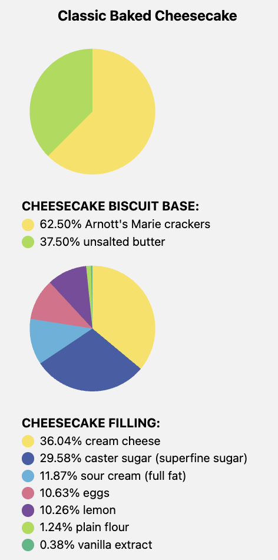

# Food Chart

Enter a recipe URL or raw ingredient text, and the app parses ingredients into a **pie chart by ingredient ratio**.  
For ingredients that are hard to convert with fixed rules (for example, `a pinch of salt`), it also predicts grams using a **lightweight ML model**.


<table>
  <tr>
    <td align="center"><b>Recipe Text Input</b></td>
    <td align="center"><b></b></td>
    <td align="center"><b>Chart Transformation</b></td>
  </tr>
  <tr>
    <td></td>
    <td align="center" style="font-size: 32px; vertical-align: middle;">➡️</td>
    <td></td>
  </tr>
</table>

---

## Demo

There are currently no images in this repository.  
If you add images at the paths below, they will render directly on GitHub.

- `docs/images/chart-main.png`
- `docs/images/mode-switch.png`
- `docs/images/predict-except-data.png`
- `docs/images/training-metrics.png`

```md


```

---

## Key Features

- **Input mode switch**: `URL Mode` / `Text Mode`
- **Automatic parsing**: `Convert to Chart` splits into `chartData` and `exceptData`
- **Pie chart visualization**: Displays ingredient ratios and percentages
- **Quantity adjustment**: `Adjust Ingredient` recalculates other ingredient amounts based on a selected ingredient amount
- **Gram prediction for exception items**: `Predict Grams for Except Data`
- **Model switching**: `deberta`, `phi3`, `llama3:8b`

---

## Why This Project

Recipe units are highly inconsistent (`cup`, `tbsp`, `clove`, `pinch`, `package`, `whole`, etc.),  
so a fixed conversion table alone is not enough for reliable weight estimation.

This project focuses on:

- Immediate chart visualization for directly convertible ingredients
- ML-based correction for ambiguous units and expressions
- End-to-end workflow from input to result in one screen

---

## Quick Start

### 1) Clone

```bash
git clone https://github.com/kml-coder/food_chart_public.git
cd food_chart_public
```

### 2) Download local model

- T5 model: [Google Drive](https://drive.google.com/file/d/1_l-JuXDqZ-0Qd15OYCNO-n60bmftbety/view?usp=drive_link)
- Unzip it, then place the model folder at `food_server/model`

### 3) Run with Docker

```bash
docker compose up --build
```

- Frontend: `http://localhost:8080`
- Backend: `http://localhost:5050`

---

## Project Structure

```text
food_app/        # React Native / Expo UI
food_server/     # Flask API + inference routing
food_model/      # Data cleaning, training notebooks, experiments
```

---

## Data Pipeline

- Detailed document: [`readme_data_pipeline.md`](docs/readme_data_pipeline.md)

---

## Model Strategy

- Detailed document: [`readme_model_details.md`](docs/readme_model_details.md)

---

## Roadmap

- [ ] Add official demo screenshots/GIFs
- [ ] Add Hugging Face model release link
- [ ] Split modeling details into `readme_model.md`
- [ ] Automate performance report generation (training logs/plots)

