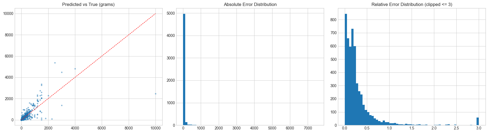

# Model Details

## Model Strategy

- Large open LLMs are possible, but they are oversized for this task in terms of cost and model footprint.
- I train domain-focused lightweight models directly for practical deployment efficiency.
- My objective is to predict grams from `unit`, `size`, and `name`, so I used an encoder-based regression model (`DeBERTa`).
- My goal was to keep the model practical for deployment while improving gram prediction quality on noisy ingredient-unit text.

## How I Built Inputs and Labels

I loaded the cleaned dataset from `final_unit_removed.json` and kept only rows where `gram > 0`.

- Input text (`text_input`) was created from normalized ingredient fields:
  - if `unit` exists: `"{quantity/article} {size} {unit} of {name}"`
  - if `unit` is empty: `"{quantity/article} {size} {name}"`
- Label was the numeric gram value from `gram`.
- For training stability, I transformed labels with `log1p`:
  - `label = log1p(gram)`
- I split the dataset into train/validation with an 80/20 split (`random_state=42`) and tokenized `text_input` with max length 96.

---

## Training Result (DeBERTa)

```text
TrainOutput(
  global_step=20150,
  training_loss=0.3624865152433552,
  metrics={
    'train_runtime': 4931.4811,
    'train_samples_per_second': 210.748,
    'train_steps_per_second': 6.59,
    'total_flos': 4311873811009200.0,
    'train_loss': 0.3624865152433552,
    'epoch': 31.0
  }
)
```

- Best checkpoint: `artifacts/deberta_v3_base_grams_text_input/checkpoint-16900`
- Best eval loss: `0.16793961822986603`

---

## Evaluation Metrics

| metric | value |
| --- | ---: |
| parse_success_rate | 1.000000 |
| MAE_g | 38.874852 |
| MAPE_pct | 40.459289 |
| within_20pct | 0.544160 |

## Range Metrics

| range_bin | count | mae_g | mape_pct | within20 |
| --- | ---: | ---: | ---: | ---: |
| 0-50g | 2320.0 | 4.972020 | 55.252387 | 0.628879 |
| 50-200g | 1762.0 | 37.010749 | 30.352781 | 0.484109 |
| 200g+ | 1115.0 | 112.362853 | 25.650032 | 0.462780 |

---

## Result Figure



---

## Model Artifacts

- My DeBERTa model path in server runtime: `DEBERTA_MODEL_PATH`
- Optional model release link (to be added):
  - `https://huggingface.co/<your-org-or-id>/<model-repo>`

---

## Documentation

Detailed model-building and experiment notes are available in:

- `food_model/gptgram_model/scrape/unit_size_cleanup.ipynb`
- `food_model/gptgram_model/t5_small_regression.ipynb`

---

## Known Limits

- Parsing quality still varies across recipe websites.
- Lines without explicit units or with highly irregular expressions rely more on model inference.
- Some ingredients have large context-dependent weight variation, even with the same name.
