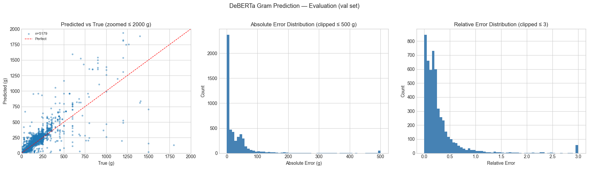
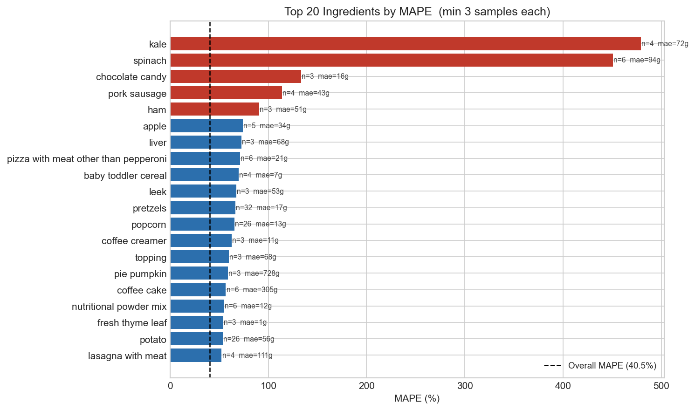
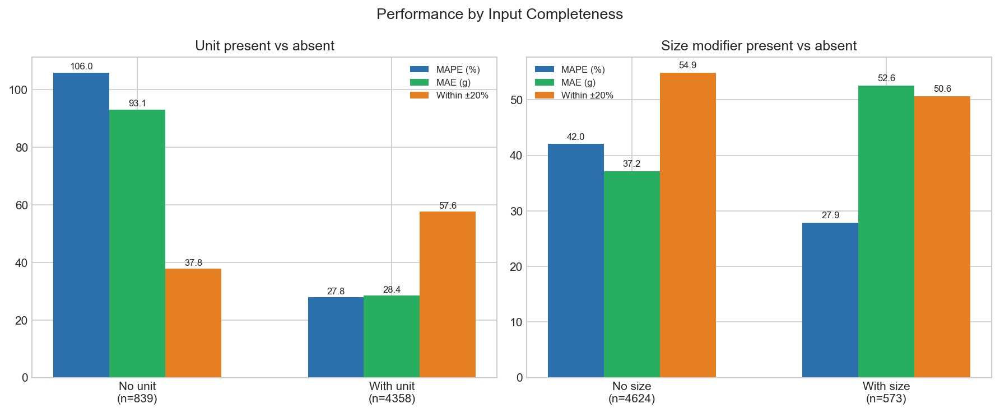
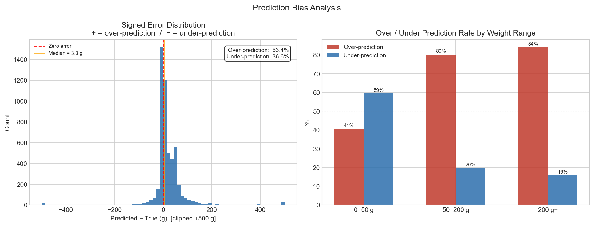
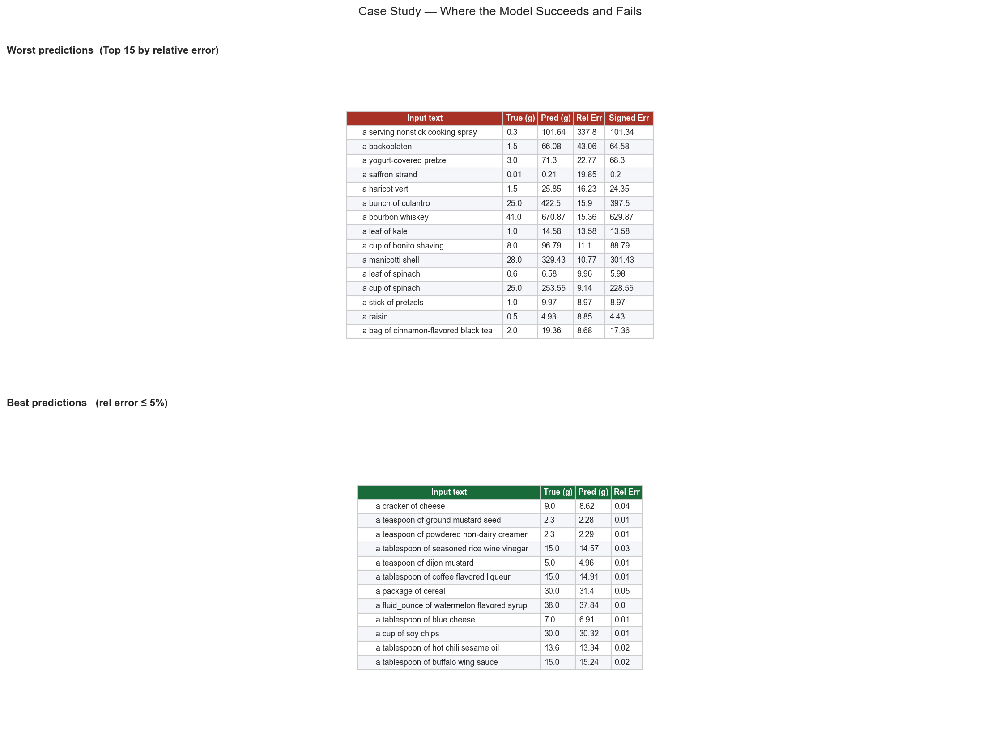

# Model Details

## Model Strategy

- Large open LLMs are possible, but they are oversized for this task in terms of cost and model footprint.
- I trained a domain-focused lightweight model directly for practical deployment efficiency.
- My objective is to predict grams from `unit`, `size`, and `name`, so I used an encoder-based regression model (`DeBERTa`).
- My goal was to keep the model practical for deployment while improving gram prediction quality on noisy ingredient-unit text.

## How I Built Inputs and Labels

I loaded the cleaned dataset from `final_unit_removed.json` and kept only rows where `gram > 0`.

- Input text (`text_input`) was created from normalized ingredient fields:
  - if `unit` exists: `"{quantity/article} {size} {unit} of {name}"`
  - if `unit` is empty: `"{quantity/article} {size} {name}"`
- Label was the numeric gram value from `gram`.
- For training stability, I transformed labels with `log1p`:
  - `label = log1p(gram)`
- I split the dataset into train/validation with an 80/20 split (`random_state=42`) and tokenized `text_input` with max length 96.
- Total usable rows (gram > 0): **25,983** — validation set: **5,197**

## Reproducibility

- Dataset file: `food_model/gptgram_model/final_unit_removed.json`
- Training split: 80/20 via `train_test_split(test_size=0.2, random_state=42)`
- Model: `microsoft/deberta-v3-base` with `num_labels=1`, `problem_type='regression'`
- Tokenization: max input length `96`
- Label transform: `log1p(gram)` for training, `expm1` for metric-space evaluation
- Training setup: epoch-level eval/save with early stopping (`patience=5`)
- Runtime note: training logs indicate a long single run to epoch `31.0` before best-checkpoint selection

---

## Training Result (DeBERTa)

```text
TrainOutput(
  global_step=20150,
  training_loss=0.3624865152433552,
  metrics={
    'train_runtime': 4931.4811,
    'train_samples_per_second': 210.748,
    'train_steps_per_second': 6.59,
    'total_flos': 4311873811009200.0,
    'train_loss': 0.3624865152433552,
    'epoch': 31.0
  }
)
```

- Best checkpoint: `artifacts/deberta_v3_base_grams_text_input/checkpoint-16900`
- Best eval loss: `0.16793961822986603`

---

## Evaluation Metrics

| metric | value |
| --- | ---: |
| parse_success_rate | 1.000000 |
| MAE_g | 38.87 |
| MAPE_pct | 40.46 |
| within_20pct | 0.544 |

## Range Metrics

| range_bin | count | mae_g | mape_pct | within20 |
| --- | ---: | ---: | ---: | ---: |
| 0–50 g | 2320 | 4.97 | 55.25 | 0.629 |
| 50–200 g | 1762 | 37.01 | 30.35 | 0.484 |
| 200 g+ | 1115 | 112.36 | 25.65 | 0.463 |

> Note: MAPE is heavily influenced by the 0–50 g range, where small absolute errors translate to large relative errors due to tiny true values (e.g. 1 saffron strand = 0.01 g). The model performs most stably in the 200 g+ range (MAPE 25.6%).

---

## Baseline Comparison

"MAE 38.87 g" means nothing without something to compare against. The obvious
skeptical question for this dataset is: *since the input is `{unit, size, name}`,
wouldn't a plain per-unit average do just as well?*

I measured it. Every baseline below is fitted on **train only** and evaluated on the
**same validation split the model used** (`test_size=0.2, random_state=42`), so this
is an apples-to-apples comparison rather than numbers from two different runs.

Reproduce: `python3 food_model/gptgram_model/eval_baselines.py` (numpy only, no torch)
→ writes `docs/baseline_metrics.md`

| Method | Learned | MAE (g) | MedAE (g) | RobustMAE (g) | MAPE (%) | Within 20% |
| --- | :--: | ---: | ---: | ---: | ---: | ---: |
| Global mean | ✗ | 105.53 | 104.94 | 84.07 | 3268.2 | 0.1512 |
| Global median | ✗ | 101.96 | 75.00 | 78.77 | 2294.2 | 0.0583 |
| Hardcoded unit dict (`server.py` heuristic) | ✗ | 75.72 | 22.00 | 48.10 | 724.0 | 0.3215 |
| Per-unit mean lookup | ✗ | 69.59 | 40.42 | 48.81 | 1506.9 | 0.2040 |
| Per-unit median lookup | ✗ | 63.93 | 32.00 | 40.19 | 691.1 | 0.2780 |
| **Per-(unit × size) median lookup** — best untrained | ✗ | **61.65** | 29.00 | 38.35 | 639.8 | **0.3009** |
| **DeBERTa v3 (shipped)** | ✓ | **38.87** | — | — | **40.5** | **0.5440** |

| | Best untrained | DeBERTa | Delta |
| --- | ---: | ---: | ---: |
| MAE | 61.65 g | 38.87 g | **−37 %** |
| MAPE | 639.8 % | 40.5 % | **−94 %** |
| Within 20% | 0.301 | 0.544 | **1.81×** |

### Why a per-unit lookup cannot close the gap

The same unit means different weights for different ingredients — liquid vs solid,
leaf size, how tightly it is packed. A lookup keyed on `unit` alone never reads the
ingredient name, so that spread is **structurally unreachable** for it.

```
cup   : cilantro 16g · basil 24g · kale 135g · spinach 200g · sugar 200g · milk 248g
bunch : parsley 40g · cilantro 30g · basil 28g · kale 188g
```

| unit | distinct ingredients | p90/p10 of per-ingredient medians | residual MAE a unit lookup cannot remove |
| --- | ---: | ---: | ---: |
| `piece` | 136 | **44.0×** | 69.6 g |
| `packet` | 82 | **44.0×** | 47.9 g |
| `package` | 88 | **22.6×** | 111.2 g |
| `bunch` | 113 | **16.1×** | 143.4 g |
| `slice` | 453 | **10.8×** | 31.4 g |
| `cup` | 6,076 | 2.9× | 59.7 g |

`1 cup` is 16 g of cilantro but 248 g of milk — a **15× spread**. Reading the
ingredient name is precisely the job the model does, and it shows up most clearly in
Within-20% (0.30 → 0.54) rather than in MAE.

---

## Chart-Slice Error

The product does not ship grams — it ships a **pie chart of proportions**. So the
metric that actually matters is not "how many grams off" but **how many percentage
points off the slice on screen is**.

> **Assumption:** the public dataset has no recipe id (see the data pipeline doc), so
> per-recipe measurement is not possible. I grouped validation rows into synthetic
> 10-ingredient recipes (4,000 draws). Real recipes are not uniform random draws, so
> these figures are approximate.

Per-slice absolute error in percentage points, best untrained baseline:

| Slice size (true share) | Mean error (pp) | Visible? |
| --- | ---: | --- |
| Small slices (< 2 %) | **2.13 pp** | no |
| Large slices (≥ 20 %) | **12.03 pp** | yes |
| All slices | 4.90 pp | — |

This is what explains the MAPE paradox. Error by true-gram bucket, same predictions:

| True range | Mean absolute error (g) | MAPE (%) |
| --- | ---: | ---: |
| 0–5 g | 17.3 | **4909** |
| 5–20 g | 16.2 | 184 |
| 20–100 g | 46.3 | 114 |
| 100–300 g | 55.6 | **30** |
| 300 g+ | 465.1 | 62 |

**The two metrics point in opposite directions.** MAPE explodes exactly where the
chart is least sensitive (sub-5 g ingredients occupy invisible slices) and looks best
exactly where chart accuracy is actually decided (100 g+ ingredients dominate the
area). MAPE is therefore the wrong headline metric for this product; slice error and
Within-20% are the right ones.

---

## Result Figures

### Overview



*Predicted vs True zoomed to ≤ 2000 g, Absolute Error clipped to ≤ 500 g, Relative Error clipped to ≤ 3.*

---

### Error Analysis

#### Fig 1 — Top 20 Ingredients by MAPE



Ingredients highlighted in red (MAPE > 80%) are structurally ambiguous: a single leaf of kale or spinach can range from <1 g to >100 g depending on serving context, and the model has no signal beyond the name. These are known hard cases, not random failures.

---

#### Fig 2 — Performance by Input Completeness



When a `unit` is present (e.g. `"a cup of sugar"`), MAPE drops from **106%** to **27.8%** and within-20% accuracy rises from **37.8%** to **57.6%**. This confirms that the unit field is the strongest predictor — inputs without units rely entirely on the model's learned density priors.

---

#### Fig 3 — Prediction Bias Analysis



The model over-predicts in **63.4%** of cases (median signed error: +3.3 g). This bias increases with weight range — in the 200 g+ bin, 84% of predictions are over-predictions. This is consistent with a log-space regression model that regresses to the mean: rare large-gram items are underrepresented in training, so the model hedges upward for ambiguous inputs.

---

#### Fig 4 — Case Study: Where the Model Succeeds and Fails



**Worst cases** share a common pattern: inputs where the unit implies a count (leaf, strand, raisin, stick) but the true gram is context-dependent and near zero. `"a serving nonstick cooking spray"` (true: 0.3 g, pred: 101.6 g) is an extreme example — the model has no spray-specific density prior.

**Best cases** are predominantly standard volumetric units (`teaspoon`, `tablespoon`, `cup`, `fluid_ounce`) applied to ingredients with stable densities (mustard, vinegar, oil, cheese). These are the inputs the model was effectively trained for.

---

## Model Artifacts

- My DeBERTa model path in server runtime: `DEBERTA_MODEL_PATH`
- Optional model release link (to be added soon):

---

## Known Limits

- **The split is train/validation only — there is no held-out test set.** The reported
  numbers are validation scores that were also used to choose between candidates
  (DeBERTa vs T5-small vs LightGBM baselines), so they carry selection bias and are
  optimistic. A three-way split is the correct fix.
- Parsing quality still varies across recipe websites.
- Lines without explicit units or with highly irregular expressions (leaf, strand, bunch) rely entirely on model inference and show significantly higher error.
- Some ingredients have large context-dependent weight variation even with the same name (e.g. `kale`, `spinach`).
- The model has a systematic over-prediction bias, especially in the 200 g+ range — likely due to underrepresentation of large-gram items in training data.
- Count-based units without a standard density prior (spray, raisin, strand) are the primary failure mode.
